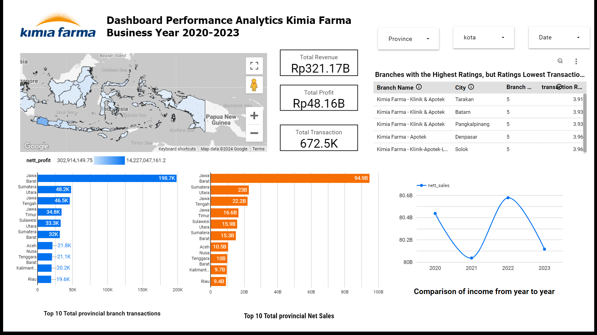

# Kimia Farma Performance Analytics 2020-2023

Tools :
 - BigQuery
 - Google Looker Studio

## Project Background
Kimia Farma is the first pharmaceutical industry company in Indonesia, established by the Dutch East Indies government in 1817. As a Big Data Analytics Intern at Kimia Farma, your duties will encompass a series of challenges that require a deep understanding of data and analytical capabilities. One of your main projects will be evaluating Kimia Farma's business performance from 2020 to 2023. The following are the tasks
you have to do:

## Importing Datasets to BigQuery
1. Obtain the provided datasets:
   - kf_final_transaction.csv
   - kf_inventory.csv
   - kf_kantor_cabang.csv
   - kf_product.csv
2. Establish a fresh project on BigQuery adhering to the specified naming conventions.
3. Import the datasets into BigQuery, assign a new table name for each dataset being uploaded, and enable auto-detection for the schema to facilitate automatic creation.

## Create Data Mart
create an analysis table based on the aggregation results of the four previously imported tables. The following are the mandatory columns in the table:
- transaction_id : transaction ID code,
- date: date the transaction was made,
- branch_id : Kimia Farma branch ID code,
- branch_name : Kimia Farma branch name,
- kota: Kimia Farma branch city,
- provinsi: Kimia Farma branch province,
- rating_cabang: consumer assessment of the Chemistry branch Pharma
- customer_name : Name of the customer who performed the action transaction,
- product_id : drug product code,
- product_name : drug name,
- actual_price : drug price,
- discount_percentage : Percentage of the discount given on medicine,
- gross_profit_percentage : What the profit percentage should be accepted from the drug under the following conditions:

      -Price <= IDR 50,000 -> 10% profit
      -Price > IDR 50,000 - 100,000 -> 15% profit
      -Price > IDR 100,000 - 300,000 -> 20% profit
      -Price > IDR 300,000 - 500,000 -> 25% profit
      -Price > IDR 500,000 -> 30% profit,
- nett_sales : price after discount,
- nett_profit: profit obtained by Kimia Farma,
- rating_transaksi: consumer assessment of transactions which is conducted.

<details><summary>SQL Query</summary>

```sql
-- Create Datamart Design --
create table kimia_farma.Analyst_Table as
SELECT
  ft.transaction_id,
  ft.date,
  ft.branch_id,
  kc.branch_name,
  kc.kota,
  kc.provinsi,
  kc.rating as rating_cabang,
  ft.customer_name,
  p.product_id,
  p.product_name,
  ft.price as actual_price,
  ft.discount_percentage,
  case
    when ft.price <=50000 then 0.1
    when ft.price >50000-100000 then 0.15
    when ft.price >100000-300000 then 0.2
    when ft.price >300000-500000 then 0.25
    when ft.price >50000 then 0.3
    else 0.3
  end as persentase_gross_laba,
  ft.price*(1-ft.discount_percentage) as nett_sales,
  (ft.price*(1-ft.discount_percentage)*
    case
    when ft.price <=50000 then 0.1
    when ft.price >50000-100000 then 0.15
    when ft.price >100000-300000 then 0.2
    when ft.price >300000-500000 then 0.25
    when ft.price >50000 then 0.3
    else 0.3
  end) as nett_profit,
  ft.rating as rating_transaksi
from
  `kimia_farma.kf_final_transaction` as ft
left join
  `kimia_farma.kf_kantor_cabang` AS KC ON  ft.branch_id=kc.branch_id
left join
  `kimia_farma.kf_product` AS p ON ft.product_id = p.product_id
;
```
</details>
<p align="center">
  
  <br>Fig.1. Data Mart Design</br>
 </p>

## Analysis Table
1. Comparison of kimia farma’s income from year to year
<details><summary>SQL Query</summary>

```sql
select
   extract(year FROM att.date ) as tahun,
   SUM(nett_sales) as pendapatan,
   AVG (nett_sales) as avg_pendapatan
 from `kimia_farma.Analyst_Table` as att
 group by tahun
 order by tahun
```
</details>
<p align="center">
  
  <br>Fig.2. Comparison of kimia farma’s income from year to year</br>
 </p>

2. Top 10 Total Transaksi Branch Province
<details><summary>SQL Query</summary>

```sql
select provinsi,
count(*) AS total_transaksi,
sum(nett_sales) as total_pendapatan
from
  `kimia_farma.Analyst_Table` as Att
group by
provinsi
order by 
total_transaksi DESC
limit 10

```
</details>
<p align="center">
  
  <br>Fig.3. Top 10 Total Transaksi Branch Province</br>
 </p>

3. Top 10 Total Profit Branch Province
<details><summary>SQL Query</summary>

```sql
select
  provinsi, sum(nett_sales) as nett_sales_cabang, count(product_id) as total_produk_terjual
from `kimia_farma.Analyst_Table`
group by provinsi
order by nett_sales_cabang desc
limit 10
```
</details>
<p align="center">
  
  <br>Fig.4. Top 10 Total Profit Branch Province</br>
 </p>

4. Top 5 Branches with the Highest Ratings, but Ratings Lowest Transactions
<details><summary>SQL Query</summary>

```sql
SELECT branch_name,kota, AVG(rating_transaksi) AS avg_rating_transaksi, rating_cabang
FROM `kimia_farma.Analyst_Table`
GROUP BY branch_name,kota,rating_cabang
ORDER BY rating_cabang desc, avg_rating_transaksi asc
LIMIT 5;
```
</details>
<p align="center">
  
  <br>Fig.5. Top 5 Branches with the Highest Ratings, but Ratings Lowest Transactions</br>
 </p>

## Create Dashboard Performance Analytics Kimia Farma Business Year 2020-2023
Kimia Farma's 2020-2023 performance analysis dashboard was created in Google Looker Studio. This dashboard was created based on an analysis table that was previously created in BigQuery, so it is necessary to connect the table to Google Looker Studio.

For Interactive Dashboard please click [this link](https://lookerstudio.google.com/reporting/429a8259-8aca-4151-ad7f-1a5d6ef194ba)


<p align="center">Fig.7. Kimia Farma Performance Analytics Dashboard

The dashboard reveals several notable insights:

- There was a remarkable surge in revenue in 2022, amounting to a 68% increase from 31 provincial branches, with total transactions reaching approximately 168 thousand. Notably, the West Java provincial branch recorded the highest total income and transactions.
- This phenomenon can be attributed to the recovery phase from the COVID-19 pandemic, particularly with the prevalence of the Omicron variant in Indonesia alongside other health concerns. Omicron is characterized by mild symptoms, facilitating its rapid spread compared to other variants, prompting heightened public health consciousness.

These insights can be translated into actionable marketing strategies:

- Launch a health promotion campaign centered on post-pandemic wellness, emphasizing the rising demand for vitamins and essential health products like masks and hand sanitizers during the recovery phase.
- Given the significant sales uptick in specific provinces, implement localized promotional initiatives tailored to each branch's context. Offer branch-specific discounts or incentives to foster customer loyalty and boost repeat purchases or transactions.
